# GELLO Assembly Instructions

Assembly SOP for the Parametric GELLO leader arms. Apply each step to **every one of the 7
servos / for each arm** you're building. An electric screwdriver is recommended. Two screw
sizes are referenced throughout as **BIG** and **SMALL** (both take the Philips bit).

## Video

https://github.com/user-attachments/assets/ba1ab702-1f16-41f2-8c47-cd73d0e13316

## Reference files

- **3D-print file:** [`gello3dp.3mf`](gello3dp.3mf)
- **Bill of materials:** [`BOM.md`](BOM.md)

## Overview

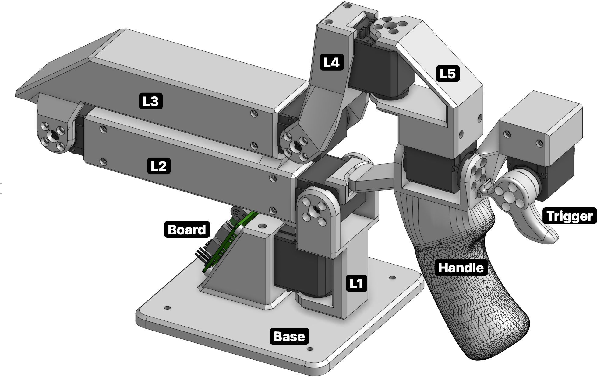

Each arm builds up as four sub-assemblies:

| Group | Parts | |
|---|---|---|
| **Group 1** | L1, L2, L3 | 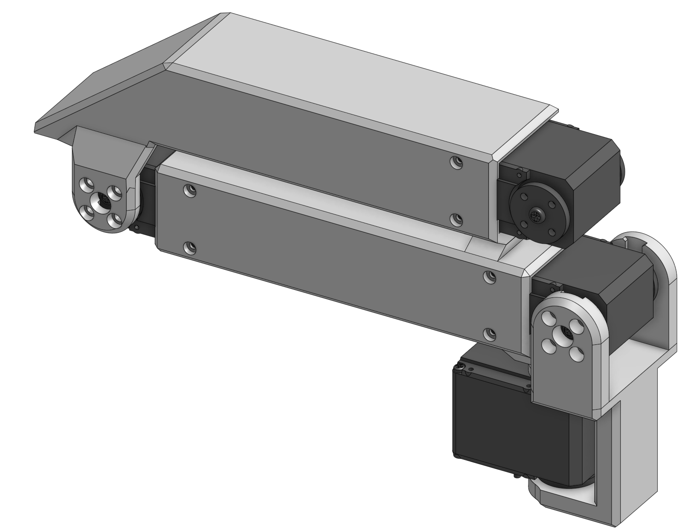 |
| **Group 2** | L4, L5 | 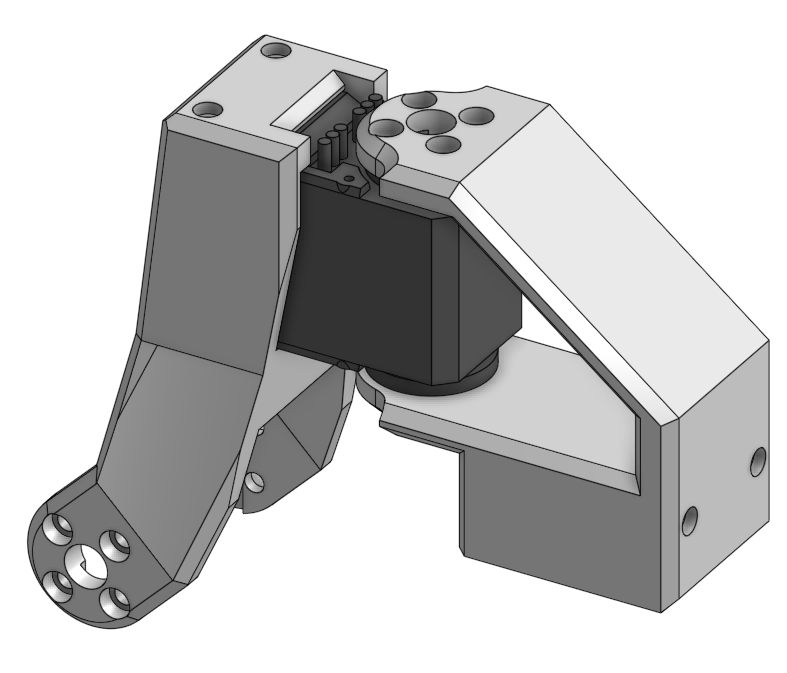 |
| **Group 3** | handle, trigger | 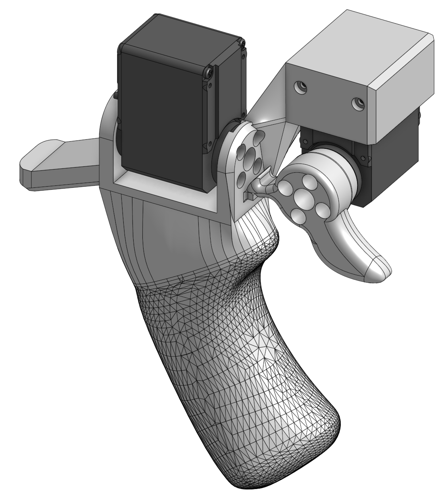 |
| **Group 4** | base + board | 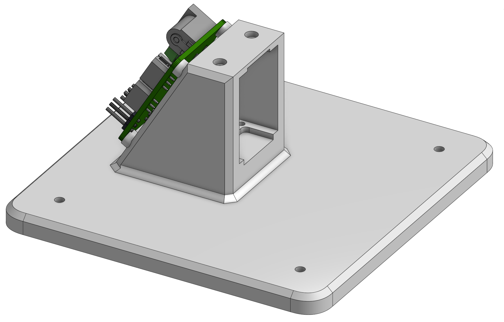 |

## Step 0 — Prepare the servos (×7 per arm)

- Ensure you have 7 Feetech STS3215 servos per arm, including the required accessories
  (mounting screws + metal servo horns).

  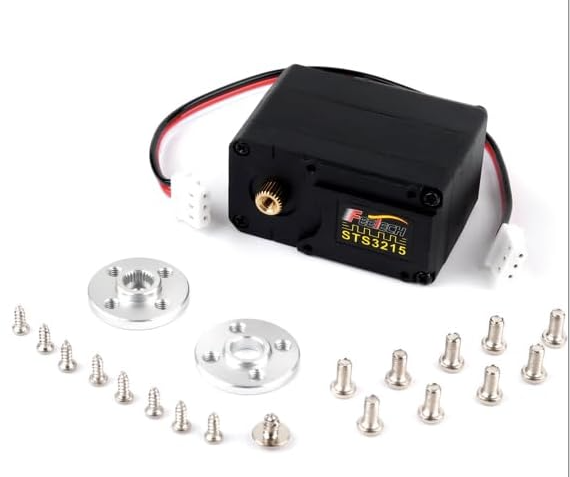

- Using a Philips screwdriver, remove the 4 screws that secure the servo's top plate (use
  pliers if needed to free the plate).
  - Keep track of which cover came off which servo, and return each cover to its own servo —
    mismatched covers may not fit back together perfectly.

  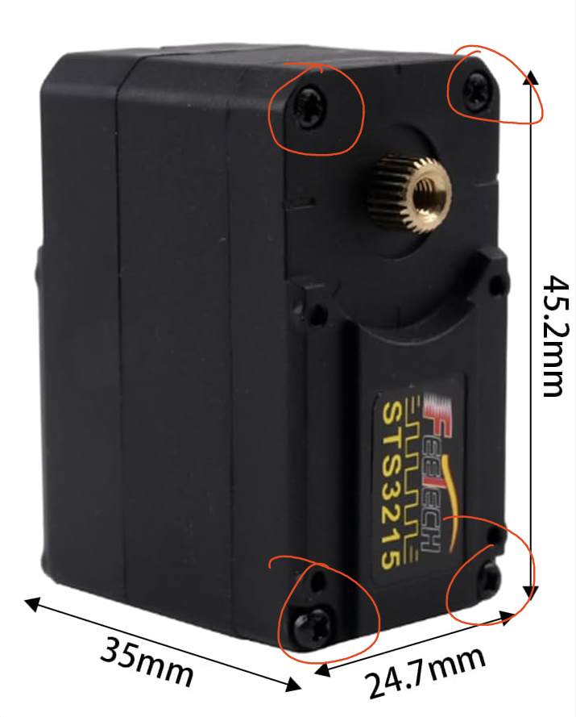

- Remove the two interior gears from the servo. This decouples the motor from the output
  shaft so the joint is **freely back-drivable** — the core GELLO principle.
  - Place the gears on a paper towel and store them as spares (in the GELLO box).
  - The interior is lubricated, so work carefully to avoid a mess.

  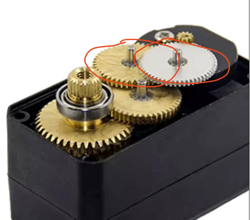

- Replace the cover and screw the four Philips screws back in.
- Identify the 2 servo horns per motor (toothed + non-toothed):
  - Mount the **toothed** horn on the toothed end of the servo — teeth lined up, pushed on
    firmly until flush, secured with a BIG screw.

    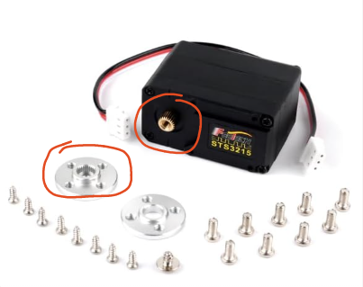

  - Mount the **non-toothed** horn on the opposite side, ring facing the servo, pushed on
    flush. Secure with the screw that has the washer (1 per motor); some resistance is
    normal.

    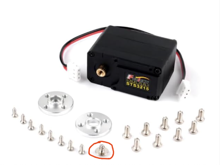
    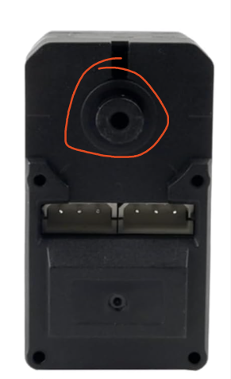

## Step 1 — Assemble each group

**Notes before you start:**
- Linkages don't need all screws — ~2 per side is adequate.
- Press-fit acceptances are orientation-dependent (they fit one way); inner guide mounts are
  omnidirectional. Keep all wire connectors pointing the direction the steps specify, or
  you'll have to redo steps.
- If you get lost, fall back on the reference images above and below.

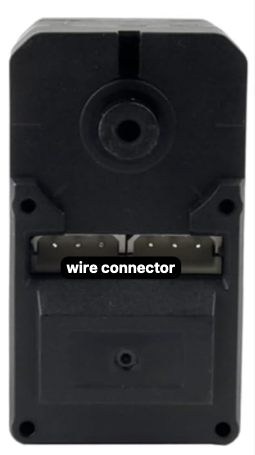

### Group 1 (L1, L2, L3)

- Press-fit servos into either end of L2; secure each side with SMALL screws.
- Press-fit a servo into the straight end of L3; secure each side with SMALL screws.
- Using L3's inner guides (all wire connectors pointing the same direction), slide L3 onto
  the end of L2 that has no hardstops (the plain rectangular extrusion); secure each side
  with BIG screws.

  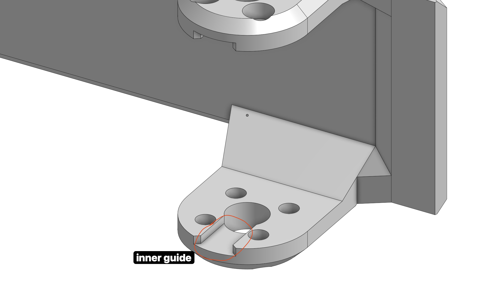

- Slide a servo into the bottom of L1 (this connects to the base) with the wire connector
  pointing down into the base, away from the rest of the assembly; secure each side with BIG
  screws.
- Slide L2's open end onto the top of L1; secure each side with BIG screws, ensuring L2
  extends back along the length of L1's servo.

### Group 2 (L4, L5)

- Press-fit a servo into L4; secure each side with SMALL screws.
- Slide L5 onto the servo; secure with BIG screws, with its press-fit acceptance pointing
  opposite the wire connector.

### Group 3 (handle, trigger)

- Slide a servo into the top of the handle, wire connectors pointing away from where the
  trigger installs; secure each side with BIG screws.
- Press-fit a servo into the trigger mount on the handle; secure each side with SMALL screws.
- Secure the trigger to the press-fit servo with BIG screws.
- Double-wrap a rubber band around the handle and slide it up to just below the bump; loop
  one of the two loops around the trigger. Confirm the trigger returns to its home hardstop
  and stops against the bump at the other limit.

### Group 4 (base + board)

- Heat-set M3×4×5 inserts into the back of the base (where the board mounts) so they sit
  flush with the 4 rings.
- Secure the board to the base with four 6–8 mm M3 bolts into the heat-set inserts.

## Step 2 — Connect the groups

**Group 3 → Group 2:** Press-fit the servo coming out of the handle (Group 3) up into the
open receiving end on L5 (Group 2); secure the open side with SMALL screws.

**Groups 2 + 3 → Group 1:** Slide Groups 2 and 3 onto the open servo on L3; secure each side
with BIG screws. Glue the hardstop home onto M1 — this is the female homing mechanism.

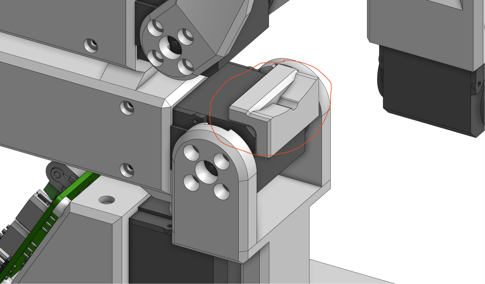

> **Do Step 3 (wiring) before attaching the base** — it's much easier to wire first.

**Groups 1 + 2 + 3 → base:** Press-fit the servo into the base; secure each side with SMALL
screws. Move the other linkages out of the way to make room.

## Step 3 — Wiring

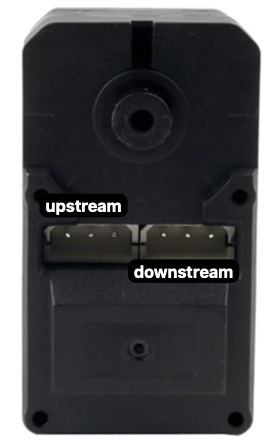

- The servos are **daisy-chained** one to the next (e.g. trigger downstream → handle upstream
  → … ), and the chain terminates at the board.
- A screwdriver helps push the wires into the sockets; cables only fit one way.
- Connect the board to the host device via USB-C.
- Upstream/downstream order doesn't technically matter — this SOP fixes an order only for
  consistency between GELLOs.

## Step 4 — Verification

See the [top-level README](../README.md) for full software bring-up.

- Power the board from an external DC source (~7.4V @ 5A) and connect it to the host via USB-C.
- **Assign each servo an ID** with
  [`feetech_servo_changeid.py`](../Uarm_teleop/Feetech_servo/feetech_servo_changeid.py) — the
  servos are all daisy-chained, so:
  - Fresh servos ship with the same default ID; assign IDs *before* wiring the full chain if
    possible.
  - Fully disconnect a servo from its neighbors before setting its ID — nothing plugged into
    either of its two ports except the single cable to the board (either port works; both are
    electrically identical).
    - This isn't only about duplicate factory defaults: the write **broadcasts to every
      powered servo on the bus**, so a servo you already assigned will be overwritten if it's
      still on the chain.
  - Index IDs from **0 (base) to 6 (gripper/trigger)**, matching each servo's position in the
    chain.
  - Set `SERIAL_PORT` at the top of the script to your board's port (mac: `ls /dev/cu.*`;
    linux: `/dev/ttyUSB0`).
  - Run `python feetech_servo_changeid.py <id>` and confirm it prints `Succeed to set id: <id>`.
  - Label each servo with its ID before moving to the next, so they don't get mixed up.
  - Once all 7 are set, wire the full chain and use
    [`feetech_gui.py`](../Uarm_teleop/Feetech_servo/feetech_gui.py) (or
    [`feetech_scan.py`](../Uarm_teleop/Feetech_servo/feetech_scan.py)) to confirm IDs 0–6 all
    respond and none are still on the factory default.
  - If reusing a servo pulled from another arm, double-check its old ID first — it can collide
    with the new chain.

---

*Mirrored from Parametric's internal Notion assembly SOP. Images are committed under
[`assembly/img/`](assembly/img/).*
